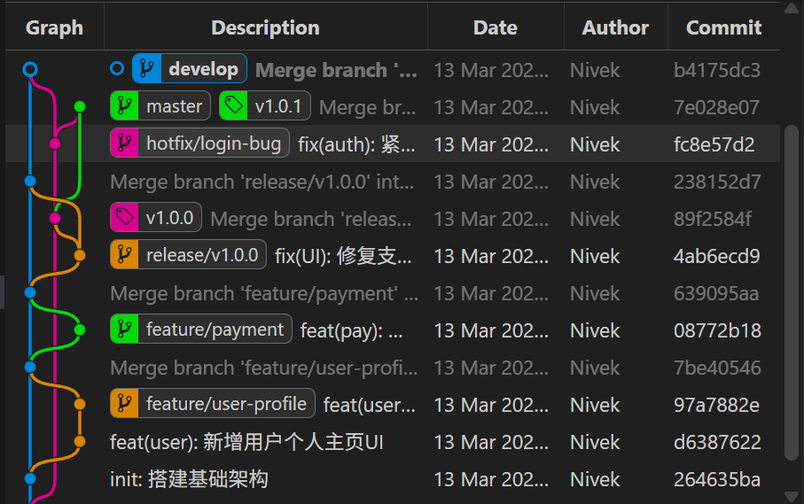
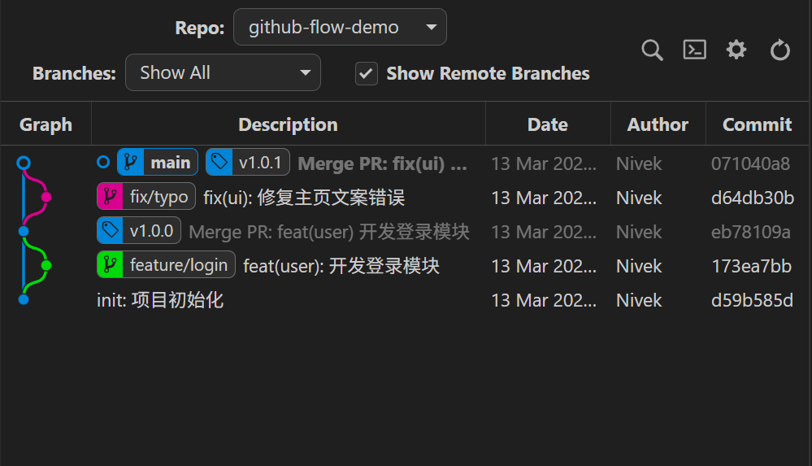
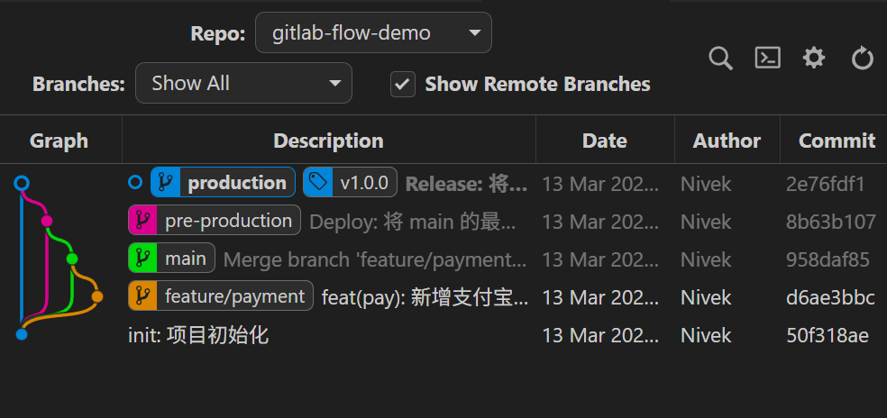
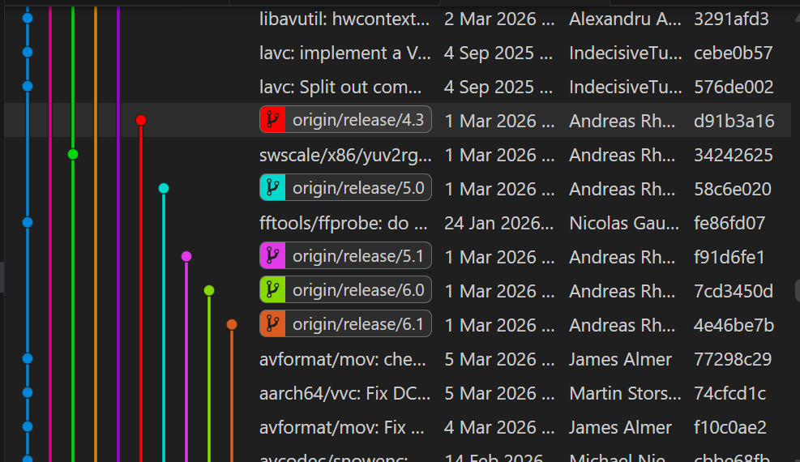
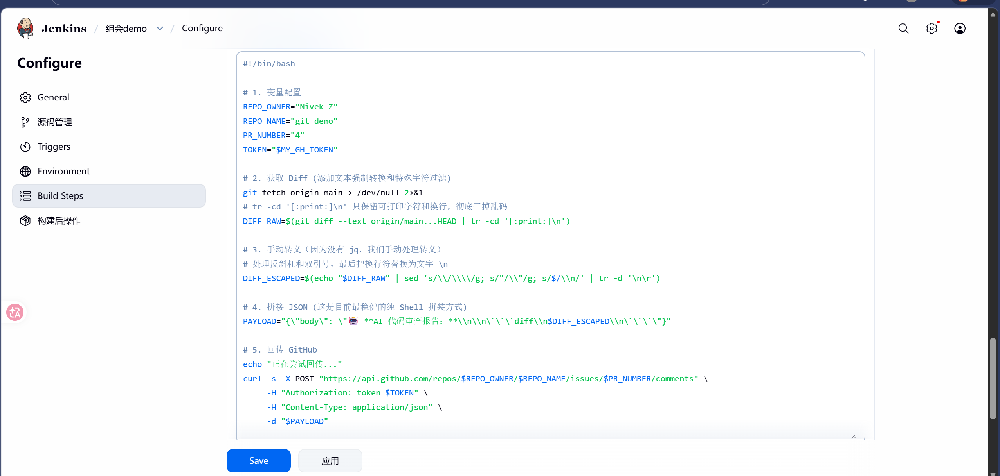


组会演示

# 三种常见的规范
### git_flow(如[git_flow_demo](https://github.com/Nivek-Z/git_flow_demo))

### github_flow(如[github_flow_demo](https://github.com/Nivek-Z/github_flow_demo),[easytier](https://github.com/EasyTier/EasyTier))

### gitlab_flow(如[gitlab_flow_demo](https://github.com/Nivek-Z/gitlab_flow_demo))

### 一些特殊的(如[ffmpeg](https://github.com/Nivek-Z/gitlab_flow_demo))

## (示例)创建pr触发webhook至jenkins,执行自动化脚本评论

